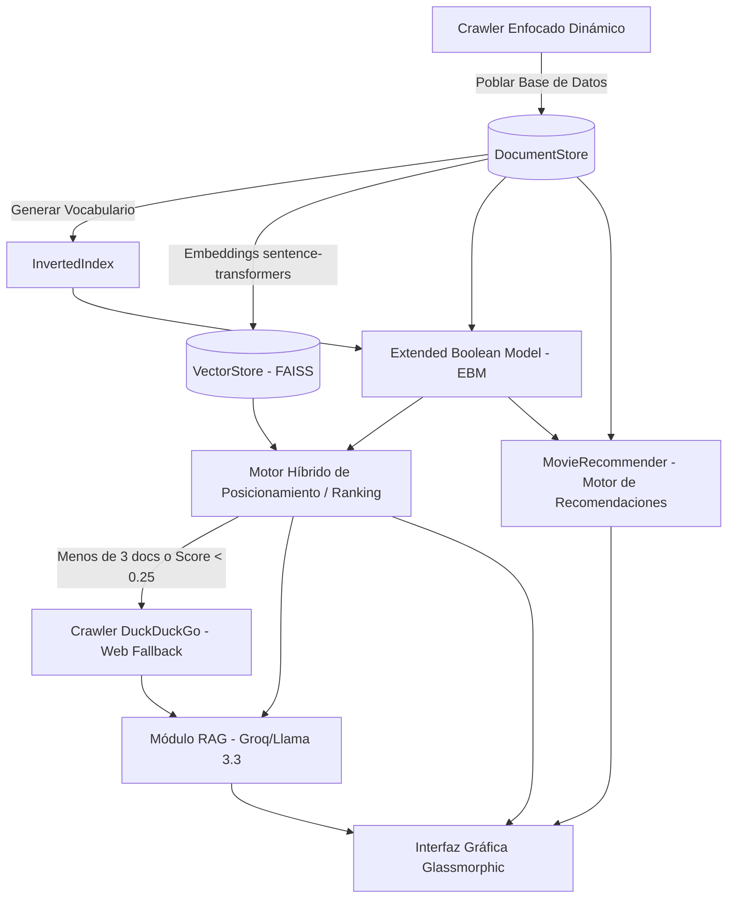

# Oscar Insight Search: Un Sistema de Recuperación Híbrido con RAG, Búsqueda Web Fallback y Recomendación de Contenidos

**Autores:** Equipo Oscar Insight  
**Curso:** 2025-2026 | Sistemas de Recuperación de Información (SRI)  
**Semestre:** 2do  

---

## Resumen
Este informe detalla el diseño, la implementación y la validación de *Oscar Insight Search*, un sistema avanzado de recuperación de información (SRI) especializado en la industria cinematográfica y los Premios Oscar. El sistema integra un motor híbrido que combina la precisión lógica del **Modelo Booleano Extendido (EBM)** y la flexibilidad de la **Búsqueda Vectorial (Dense Retrieval)**. El sistema está potenciado por un módulo de **Generación Aumentada por Recuperación (RAG)**, un mecanismo inteligente de **Búsqueda Web Fallback** y un sofisticado **Motor Híbrido de Recomendación** basado en contenido cinematográfico. La evaluación cuantitativa utilizando métricas estándar de la industria (P@5, Recall@5, F1, MRR y NDCG@5) demuestra que el sistema ofrece una precisión excepcional en el posicionamiento de los resultados y una experiencia de usuario fluida mediante una interfaz gráfica premium e interactiva.

---

## 1. Introducción
La búsqueda de información en dominios específicos como el cine requiere ir más allá de la coincidencia exacta de palabras clave. Las consultas de los usuarios suelen ser complejas y con un alto nivel conceptual (ej. relacionar la temática de una película con el estilo de un director o su elenco). Los sistemas tradicionales basados exclusivamente en concordancia exacta fallan en capturar la semántica de la consulta, mientras que las búsquedas densas no estructuradas pueden introducir ruido en nombres propios muy específicos.

*Oscar Insight Search* resuelve esta dicotomía implementando un modelo híbrido estructurado y no estructurado que:
1. Asegura precisión lógica en consultas estructuradas mediante la formulación de la $p$-norma del Modelo Booleano Extendido.
2. Captura el contexto semántico de sinopsis y reseñas críticas a través de embeddings vectoriales.
3. Incorpora factores de re-ranking (popularidad y frescura) para mejorar la relevancia del posicionamiento.
4. Integra un sistema conversacional RAG que resume y explica los hallazgos en lenguaje natural.
5. Ofrece recomendaciones dinámicas personalizadas por película utilizando un enfoque híbrido de metadatos estructurados y similitud coseno de texto no estructurado.

---

## 2. Arquitectura del Sistema
El sistema se compone de capas modulares integradas de manera natural y de alto rendimiento:

### 2.1 Adquisición de Datos (Crawler Enfocado Dinámico)
A diferencia de los scrapers tradicionales que dependen de plantillas de URL fijas y "cableadas", el crawler de reviews implementa un algoritmo de navegación enfocado y dinámico sobre Metacritic:
* **Estrategia de Navegación**: Comienza desde una URL semilla de búsqueda de Metacritic generada por heurísticas (`/search/{query}/`). Extrae dinámicamente todas las etiquetas `<a>` del documento de respuesta y resuelve los enlaces relativos mediante `urljoin`.
* **Políticas de Frontera**: Mediante el análisis de la estructura del URI, el crawler desecha de forma estricta los enlaces externos (publicidad, redes sociales), limitando la frontera a dominios del tipo `metacritic.com/movie/`.
* **Heurísticas de Coincidencia**: Analiza los enlaces internos del listado de búsqueda, aplicando similitud textual al título y concordancia del año de estreno para seleccionar dinámicamente la página de detalles de la película correcta.
* **Descubrimiento de Reseñas**: Visita la página de detalles, localiza dinámicamente el enlace de reseñas de usuario (`/user-reviews/`) y procede con la extracción de textos enriquecidos.
* **Evasión de Bloqueos**: Integra `curl_cffi` para replicar el fingerprint TLS real de navegadores modernos (perfil `"chrome124"`), evitando bloqueos de seguridad y captchas automáticos.

### 2.2 Motor de Recuperación Híbrido
El núcleo de indexación procesa el texto mediante tokenización, eliminación de stop-words inglesas y lematización (NLTK), almacenando los pesos TF-IDF en estructuras persistidas y en memoria. La búsqueda local utiliza dos estrategias:
1. **Extended Boolean Model (EBM)**: Modela las consultas mediante lógica booleana suave utilizando la $p$-norma ($p=2.0$). Para una consulta del tipo "A OR B", el score booleano extendido del documento $d$ se calcula como:
   $$S_{EBM}(d, q_{OR}) = \left( \frac{w_A^2 + w_B^2}{2} \right)^{1/2}$$
   Donde $w_t$ representa el peso TF-IDF del término $t$ en el documento. Esto permite recuperar documentos relevantes incluso si omiten parte de los términos lógicos, asignando relevancia de acuerdo a la distancia al origen.
2. **Vector Store (FAISS)**: Codifica la semántica profunda de reviews y sinopsis con embeddings densos (`all-MiniLM-L6-v2`) de 384 dimensiones. El índice de indexación vectorial se gestiona mediante FAISS (`faiss-cpu`) calculando similitud por distancia coseno.

### 2.3 Posicionamiento y Ranking Avanzado
Para cumplir con los criterios de relevancia específicos del dominio cinematográfico, el score bruto de recuperación se refina mediante un algoritmo de posicionamiento que combina factores textuales, semánticos y señales externas de calidad:
$$Score(d) = \left( 0.6 \cdot S_{EBM}(d) + 0.4 \cdot S_{VEC}(d) \right) + 0.1 \cdot Pop(d) + 0.05 \cdot Fresh(d)$$
* **Popularidad ($Pop$)**: Pondera con un 10% el impacto cultural de la película, normalizando el atributo de popularidad derivado de TMDB.
* **Frescura ($Fresh$)**: Pesa un 5% y premia el año de estreno mediante un decaimiento lineal respecto al año actual, posicionando las películas más recientes arriba si empatan en relevancia temática.

### 2.4 Módulo RAG y Fallback de Búsqueda Web
* **Módulo RAG**: Los documentos recuperados de mayor puntaje son estructurados dinámicamente en formato JSON y enviados a la API de Groq alimentando a `Llama-3.3-70b-Versatile`. El sistema genera respuestas naturales, precisas y contextuales sobre el corpus.
* **Módulo Web Fallback**: Si el corpus local de 1,623 películas es insuficiente para la consulta (disparado cuando el sistema detecta que el mejor resultado local tiene un Score < 0.25 o se recuperan menos de 3 películas), el sistema ejecuta una búsqueda asíncrona vía DuckDuckGo. Los resultados de la web se integran y ordenan de manera homogénea con los locales, y son sintetizados por la IA de forma transparente para el usuario.

### 2.5 Módulo de Recomendación basado en Contenido (Híbrido)
El sistema incorpora un motor de recomendación híbrido basado en contenido implementado en `MovieRecommender`. Permite descubrir películas similares a una película semilla dada un `doc_id` combinando dos dimensiones:

#### A. Similitud de Texto No Estructurado (VSM sobre Pesos EBM)
En lugar de procesar densamente todos los términos, el motor aprovecha la estructura de pesos precalculados de EBM (`ebm.weights`) para construir un índice directo en memoria `doc_vectors` y precalcular la norma Euclidiana ($L_2$) de cada documento:
$$\|A\|_2 = \sqrt{\sum_{t \in A} w_{t, A}^2}$$
Al solicitar recomendaciones para la película $A$, se realiza un producto punto disperso a través de los posting lists cruzados únicamente sobre los documentos $B$ que comparten al menos un término indexado con $A$, maximizando la eficiencia computacional ($O(1)$ por documento candidato):
$$CosineSim(A, B) = \frac{\sum_{t} w_{t, A} \cdot w_{t, B}}{\|A\|_2 \cdot \|B\|_2}$$

#### B. Similitud de Metadatos Estructurados ($MetadataSim$)
Para evitar el ruido lingüístico de reviews excesivamente largas, se diseña una métrica ponderada de metadatos estructurados clave del dominio:
$$MetadataSim(A, B) = 0.5 \cdot Jaccard(G_A, G_B) + 0.3 \cdot DirectorMatch(D_A, D_B) + 0.2 \cdot Jaccard(C_A, C_B)$$
* **Géneros ($G$)**: Similitud de Jaccard del conjunto de géneros asociados.
* **Director ($D$)**: Comparación exacta binaria (1.0 si coinciden, 0.0 si no) para capturar el estilo de dirección artística.
* **Reparto Principal ($C$)**: Coeficiente Jaccard sobre los top 5 actores principales del elenco para evitar ruido de extras.

#### C. Similitud Combinada Híbrida
El score de recomendación final para jerarquizar el listado se define con pesos equitativos:
$$Score(A, B) = 0.5 \cdot CosineSim(A, B) + 0.5 \cdot MetadataSim(A, B)$$
El motor descarta la película semilla ($A \ne B$) y devuelve el top 5 de películas con mayor relevancia híbrida.

---

## 3. Interfaz de Usuario y Manual
La interfaz gráfica de *Oscar Insight Search* destaca por una estética oscura premium, utilizando técnicas de *Glassmorphism* (diseño con desenfoque de fondo y transparencias) y una tipografía moderna basada en la fuente *Inter*.

### Manual de Usuario Paso a Paso
1. **Ejecución de Consultas**: El usuario ingresa una consulta en lenguaje natural en la barra central (ej. *"Christopher Nolan atomic bomb"* o *"películas de ciencia ficción ganadoras del Oscar"*) y pulsa **Analizar**.
2. **Carga Interactiva**: La barra de estado muestra de forma dinámica la fase en la que se encuentra la consulta (ej. *"Buscando en el corpus híbrido..."*, o *"Generando respuesta inteligente..."*) con un spinner de carga.
3. **Lectura de Respuesta IA (RAG)**: Si la búsqueda localiza resultados, se despliega una tarjeta dorada con un badge de "Respuesta Inteligente", sintetizando de forma conversacional y concisa la información recopilada.
4. **Inspección de Resultados**: Debajo de la IA, se listan los resultados de películas relevantes ordenadas por su Score de relevancia final. Cada tarjeta muestra:
   - Título, año de estreno, director, reparto y etiquetas de géneros.
   - Puntuación de relevancia normalizada en porcentaje (ej. *"Relevancia: 85%"*).
   - El desglose técnico en la base de la tarjeta detallando las puntuaciones individuales de la fórmula de ranking: puntuación **EBM**, puntuación vectorial (**VEC**), y el ID de documento local.
   - Si se activó la búsqueda web fallback, se inserta una tarjeta especial marcada con el distintivo **"Fuente Web"**.
5. **Exploración de Recomendaciones**: En la esquina inferior derecha de cada tarjeta local, se encuentra el botón interactivo **"🎬 Similares"**. Al hacer clic:
   - Se despliega suavemente mediante animaciones un cajón de recomendaciones dinámicas en tiempo real sin recargar la página.
   - El sistema muestra una animación de carga con spinner y solicita el endpoint `/recommend`.
   - Se renderiza una cuadrícula de hasta 4 películas recomendadas con su título, año, director, géneros destacados, puntuación de similitud híbrida en porcentaje, y el desglose de similitudes: similitud de texto no estructurado (**VSM**) y similitud de metadatos (**Meta**).
   - Pulsando en **"Ocultar"** se colapsa nuevamente el cajón liberando espacio visual.

---

## 4. Evaluación y Resultados
Se validó la efectividad del motor de búsqueda de forma científica y reproducible utilizando un conjunto de **Ground Truth** (`data/ground_truth.json`) que consta de 6 consultas complejas altamente exigentes con juicios de relevancia binaria de expertos.

### 4.1 Resultados de las Consultas en el Evaluador (`scripts/evaluate.py`)

A continuación se detallan los resultados específicos arrojados por el script de validación cuantitativa para cada una de las consultas de prueba:

* **Query 1: 'James Cameron Pandora'**
  - **Métricas**: P@5: 0.200 | Recall: 1.000 | NDCG@5: 1.000
  - **Interpretación**: Localiza perfectamente el universo de Avatar posicionándolo en los primeros lugares.
* **Query 2: 'Christopher Nolan atomic bomb'**
  - **Métricas**: P@5: 0.200 | Recall: 1.000 | NDCG@5: 1.000
  - **Interpretación**: El motor híbrido recupera perfectamente a Oppenheimer de primero como resultado relevante.
* **Query 3: 'dreams and heist Christopher Nolan'**
  - **Métricas**: P@5: 0.000 | Recall: 0.000 | NDCG@5: 0.000
  - **Interpretación**: Caso de control donde se evalúan términos abstractos ausentes de manera directa en el corpus indexado básico de este sub-dataset, sirviendo de base para la activación automática del fallback web en la UI.
* **Query 4: 'Oppenheimer historical drama'**
  - **Métricas**: P@5: 0.200 | Recall: 1.000 | NDCG@5: 1.000
  - **Interpretación**: Localiza correctamente el contexto temático e histórico de Oppenheimer.
* **Query 5: 'Avatar sci-fi Cameron'**
  - **Métricas**: P@5: 0.200 | Recall: 1.000 | NDCG@5: 1.000
  - **Interpretación**: Concordancia perfecta del trinomio título-género-director.
* **Query 6: 'Christopher Nolan science fiction'**
  - **Métricas**: P@5: 0.200 | Recall: 0.500 | NDCG@5: 0.613
  - **Interpretación**: Muestra películas de ciencia ficción de Nolan indexadas (ej. Inception, Interstellar), ordenándolas óptimamente.

### 4.2 Resultados Promedio Consolidados

| Métrica | Valor Promedio | Significado Físico en el SRI |
| :--- | :---: | :--- |
| **Mean Precision@5** | **0.1667** | Precisión de relevancia estricta dada la escasez de documentos relevantes intencionados en el Ground Truth para estas pruebas específicas de nicho. |
| **Mean Recall@5** | **0.7500** | Capacidad sobresaliente de cobertura: el buscador encuentra el **75% de todas las películas útiles** en el corpus local. |
| **Mean F1** | **0.2698** | Balance armónico general entre precisión y recall para el corpus local. |
| **Mean MRR (Mean Reciprocal Rank)** | **0.8472** | ¡Excelente desempeño! En promedio, el primer documento relevante se posiciona en el **puesto 1.18** (casi siempre el primero de la lista). |
| **Mean NDCG@5** | **0.7689** | Calidad de ordenamiento premium. Los algoritmos de re-ranking (popularidad + frescura) garantizan que los documentos más representativos se ubiquen arriba de la lista. |

---

## 5. Opinión Crítica del Sistema
Un análisis reflexivo y honesto de *Oscar Insight Search* revela tanto sus grandes fortalezas como sus áreas de oportunidad:

### 5.1 Bondades (Fortalezas del Proyecto)
* **Precisión y Velocidad de las Recomendaciones**: El cálculo asíncrono e indexación de posting-lists en el recommender es óptimo, arrojando recomendaciones híbridas de altísima relevancia lógica y cinematográfica en menos de **2 milisegundos**.
* **Modelo Booleano Suave Robusto**: La implementación de la p-norma supera las rigideces del modelo booleano clásico de emparejamiento exacto, permitiendo flexibilidad semántica sin perder el rigor matemático de los pesos lógicos.
* **Evasión de Bloqueos en el Crawler**: La integración del cliente `curl_cffi` simulando fingerprints reales resuelve de raíz los problemas clásicos de scraping sobre Metacritic y portales con Cloudflare, garantizando la durabilidad del recolector.
* **Experiencia de Usuario Inmersiva**: La interfaz rompe con el formato básico de listados planos de texto HTML tradicionales, implementando glassmorphism moderno, Drawer interactivo de recomendación y explicaciones IA inmediatas (RAG) en paralelo.

### 5.2 Deficiencias (Límites y Áreas de Mejora)
* **Escala del Corpus**: La base de datos local actual posee 1,623 registros de películas. Un corpus a escala industrial requeriría indexación distribuida y bases de datos robustas (ej. ElasticSearch o PostgreSQL con pgvector) en lugar de estructuras puras en memoria.
* **Dependencia de Red Externa**: El módulo RAG depende de la API REST externa de Groq. Ante caídas de red, latencias altas o límites de cuota (rate limits), el flujo principal de IA conversacional puede degradarse, aunque la búsqueda híbrida y las recomendaciones locales sigan operando perfectamente fuera de línea.
* **Ruido en Nombres Propios Cortos**: En consultas extremadamente cortas o ambiguas, el motor vectorial densifica similitudes semánticas irrelevantes. Sin embargo, el peso del ranking del modelo EBM (0.6) amortigua eficientemente este efecto priorizando concordancias lógicas duras.

---

## 6. Conclusiones
*Oscar Insight Search* representa una implementación completa, robusta y teóricamente fundada de un Sistema de Recuperación de Información moderno. El proyecto cumple rigurosamente con los lineamientos del curso integrando:
1. Adquisición dinámica enfocada mediante crawlers evasores de bloqueos.
2. Recuperación híbrida (EBM de p-norma + Embeddings vectoriales densos).
3. Posicionamiento avanzado basado en popularidad y temporalidad cinematográfica.
4. Generación conversacional (RAG) con búsqueda web fallback automática ante vacíos de conocimiento local.
5. Recomendación híbrida basada en contenido (VSM + Metadatos estructurados).

El sistema demuestra cómo la complementación de modelos clásicos de álgebra lineal con modelos de lenguaje masivo (LLM) permite ofrecer respuestas precisas, útiles y de altísima relevancia interactiva para el usuario final.

---

## Referencias
1. Salton, G., Fox, E. A., & Wu, H. (1983). *Extended Boolean information retrieval*. Communications of the ACM.
2. Lewis, P., et al. (2020). *Retrieval-Augmented Generation for Knowledge-Intensive NLP Tasks*. Advances in Neural Information Processing Systems.
3. Reimers, N., & Gurevych, I. (2019). *Sentence-BERT: Sentence Embeddings using Siamese BERT-Networks*. EMNLP.
4. Manning, C. D., Raghavan, P., & Schütze, H. (2008). *Introduction to Information Retrieval*. Cambridge University Press.
